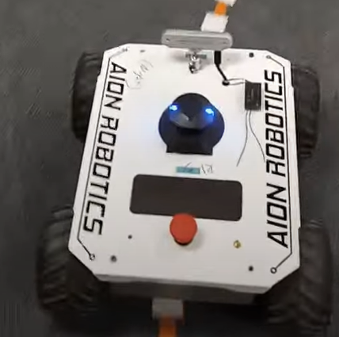
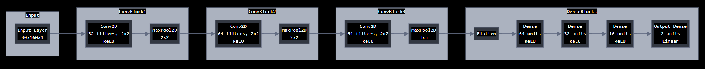

# Autonomous Rover

By: Thomas Blalock 
Date: April 23, 2024 

## Summary
In this project, I developed an autonomous RC rover using a combination of behavioral cloning and reinforcement learning techniques. The rover navigates a track by processing images from its onboard camera to predict steering and throttle commands. See a video of the finished product in action [here](https://photos.app.goo.gl/r1x9JuZwNcA57p7E7).

## Table of Contents
1. [QuickStart](#quickstart)
2. [Introduction](#introduction)
4. [System Architecture](#system-architecture)
5. [Key Features](#key-features)
6. [Methodology](#methodology)
7. [Results](#results)
8. [Discussion](#discussion)
9. [Future Work](#future-work)
10. [References](#references)

## QuickStart

Follow these steps to quickly set up and use this codebase.

### 1. Set Up Your Rover

Using whatever hardware you have available, contruct your rover. Make a function that controlls the rover's steering and throttle. If you are using a 'dronekit' compatible rover, you can use the 'utilities/drone_lib.py' file to interface with the rover. Make a function that returns a stream of camera feed. If you are using a RealSense camera, you can use the 'utilities/rover_recorder.py' file to interface with the camera.

### 2. Set Up The Track

Buy colored tape (white works well) and create a racetrack on the ground. 

### 3. Collect Data

Change the filepath at the top of 'rs_rover_collect.py' to your desired directory to store the data. Run the 'rs_rover_collect.py' file and and follow the prompts to collect data. It will tell you to arm the rover, then start driving the rover. The model will learn signiciantly easier if you drive the rover slowly and smoothly.

### 4. Preprocess The Data

Change the filepaths in 'rover_data_processor.py' to your data filepath and select a directory for the processed data. Run 'rover_data_processor.py' and verify the data is being preprocessed on the open images.

### 5. Train the model.

Specify the data directories and the path to which you want to save your trained models at the top of 'pex02_assist_package/model_training.py'. Run 'pex02_assist_package/model_training.py'.

### 6. Run the Rover
Place the rover on the track. Specify the filepath to the trained model at the top of 'rover_driver.py' and run the file. Follow the prompts.

## Introduction

This project was a part of the 'Autonomous Systems Integrations' class at the US Air Force Academy. This project involves building an autonomous RC rover capable of navigating a track using machine learning techniques. The main components include:

- Data Collection Pipeline: Captures driving data from the rover, including images and control commands.
- Rover Interface Code: Interfaces with the rover hardware to send commands and receive data.
- Behavioral Cloning Model: A Convolutional Neural Network (CNN) trained to imitate human driving behavior.
- Reinforcement Learning Enhancements: Implements further training to improve the model.

## Contructing the Rover

The rover was assembled using a standard RC chassis equipped with:

- An onboard camera for real-time image capture.
- A microcontroller or single-board computer to process images and run the control algorithms.
- Motors and servos for throttle and steering control.

## Interfacing With the Rover

Interfacing with the rover involved:
- Communication Protocols: Establishing a connection between the control software and the rover hardware, using wifi.
- Control Commands: Sending throttle and steering commands to the rover's motor controller.
- Data Retrieval: Receiving image data from the onboard camera for processing.

The code to interface with the rover handles:
- Arming and disarming the rover safely.
- Real-time command execution for responsive control.
- Data logging for training and debugging purposes.

## Data Acquisition

A data collection pipeline was developed to gather the necessary training data:
- Image Capture: Recording images from the rover's camera as it navigates the track.
- Control Data: Simultaneously logging throttle and steering commands issued during manual driving sessions.
- Synchronization: Ensuring that each image is accurately paired with the corresponding control commands.
This data serves as the foundation for training the behavioral cloning model and the reinforcement learning enhancements.

## Data Preprocessing

Before training, the collected data underwent preprocessing:

Image Processing:
- Conversion to grayscale or normalization if required.
- Resizing images to match the input dimensions expected by the CNN.
- Applying any necessary filters to enhance features.

Label Processing:
- Normalizing throttle and steering values to a consistent scale.
- Formatting data into training and validation sets.

## CNN Model

The core of the project is a Convolutional Neural Network designed to predict steering and throttle commands from images.

Architecture:
- Multiple convolutional layers to extract spatial features from images.
- Fully connected layers to interpret features and output control commands.
- Activation functions and normalization layers to improve learning efficiency.

Input: Preprocessed images from the rover's camera.
Output: Predicted steering and throttle values.

## Model Training

### Behavioral Cloning
The initial training used behavioral cloning:  
Approach: The model learns to imitate the actions recorded during manual driving sessions. 
Process:
- Input images paired with corresponding throttle and steering commands.
- Training over several epochs with mean squared error.
Outcome: The model could autonomously navigate the track by mimicking human driving behavior.

### Reinforcement Learning
To improve the model, we implimented a version of reinforcement learning. A critic model was trained using a score calculated from an image several timesteps after the current timestep and the gradient for the actor were calculated through the critic. The theory is that since high loss occurs when the rover is off-center (track edges in the image) and throttle is high, it would encourage the rover to slow down when not centered and maintain speed when properly aligned.

## Results

The project yielded the following results:

*Behavioral Cloning Model:*
- Successfully navigated the track by imitating human driving.
- Limited adaptability to new scenarios or errors.

*Actor-Critic Model:*
- Achieved balanced optimization of steering and throttle.
- Improved ability to stay centered on the track while maintaining appropriate speed.
- Demonstrated the effectiveness of incorporating future state evaluations.
